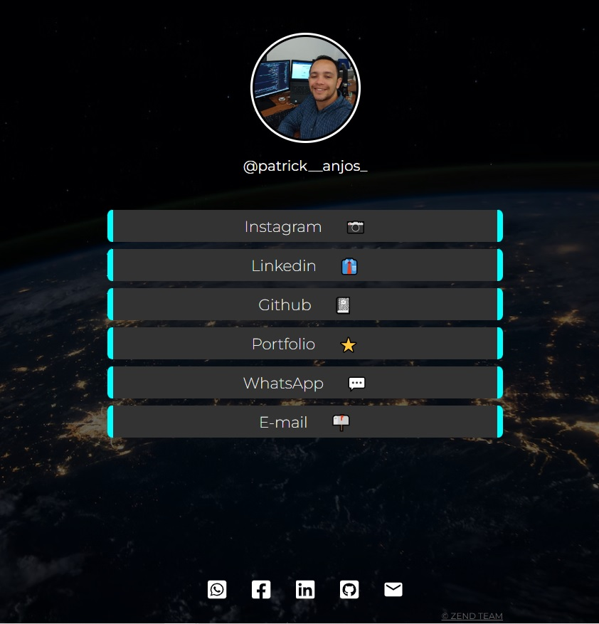
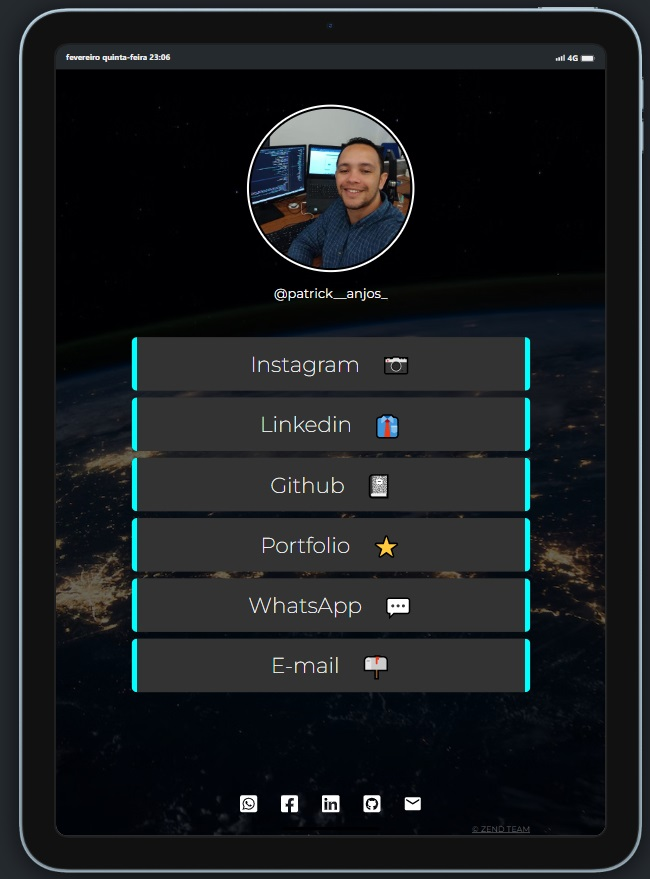
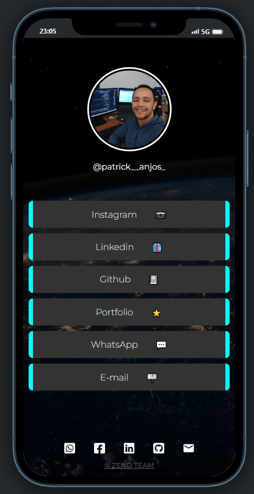

## LinkTree

<div align="center">
    Access <a href="https://63dc70ce04bcbf7b3241205d--magical-gecko-61265b.netlify.app/" target="_blank" rel="noreferrer">Deploy</a>
</div>

<div align="center">
    
</div>

```
    PC
```

---

<div align="center">
    
</div>

```
    TABLET
```

---

<div align="center">
    
</div>

```
    MOBILE
```

---

## Participants

[](https://github.com/setxpro)

[Patrick Anjos](https://github.com/setxpro)

## Techs

- [x] React
- [x] TypeScript

Alter error with deploy in netlify

## Starting Dev Environment

Run `npm install` or `yarn install`.<br />
